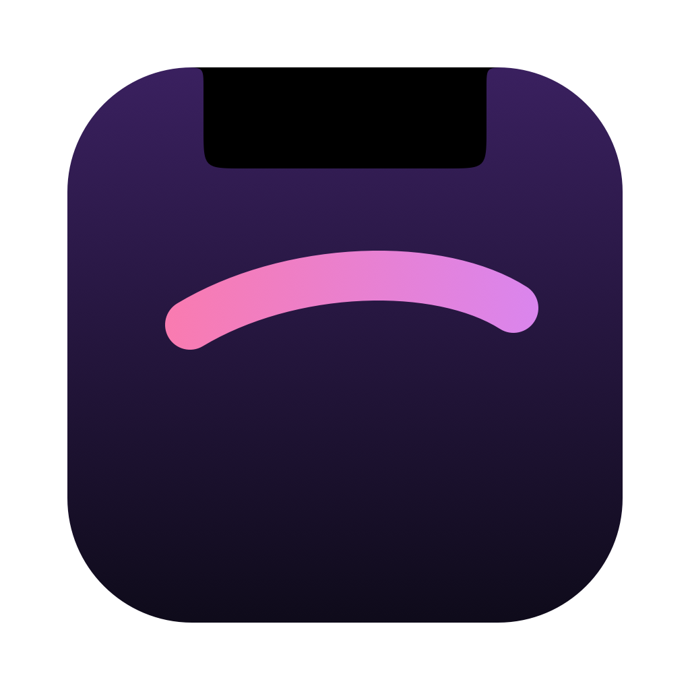
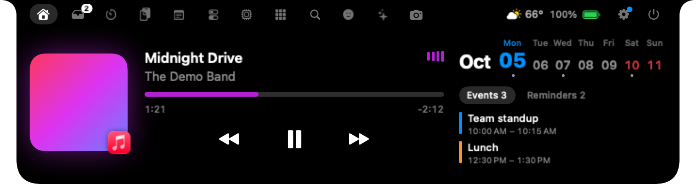
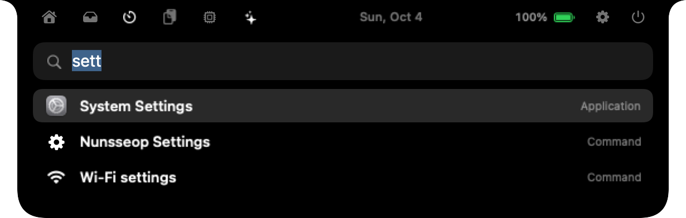
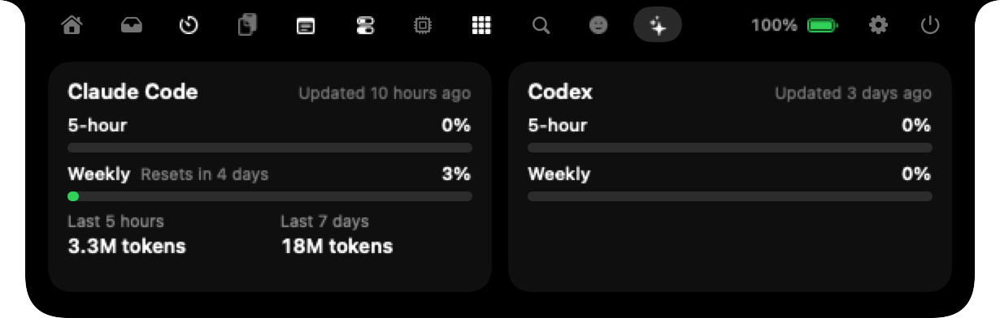
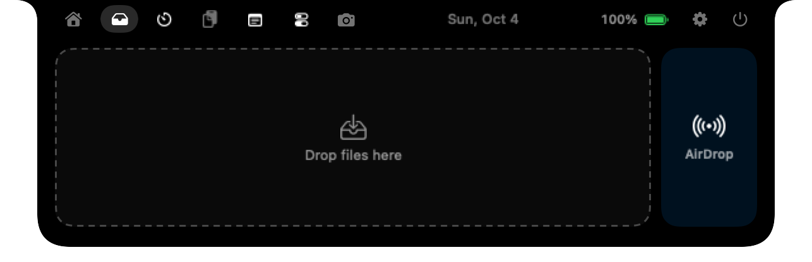
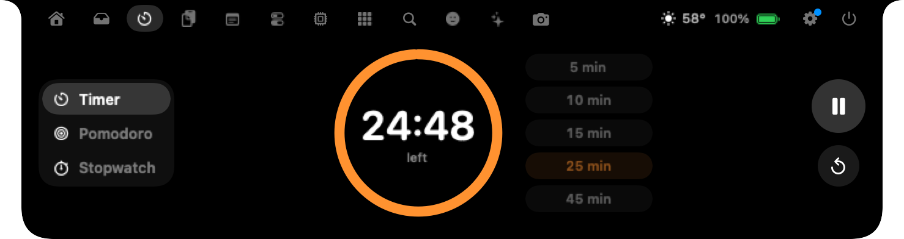
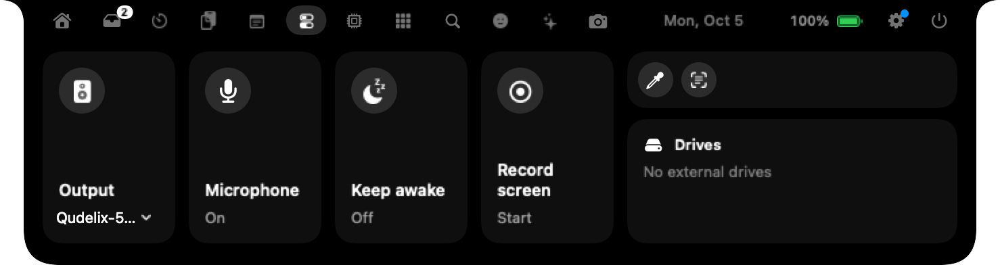
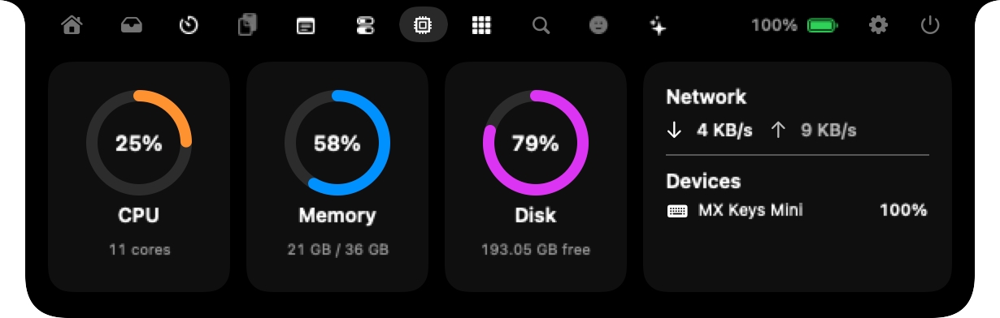
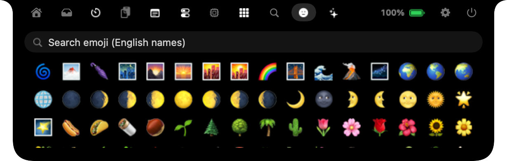

<p align="center"></p>

<h1 align="center">Nunsseop · 눈썹</h1>

<p align="center">
  <b>MacBook 노치, 이제 쓸모 있게.</b><br>
  음악, 파일, Spotlight 같은 검색, AI 사용량, 일정, 시스템 HUD가 마우스만 올리면 열립니다.
</p>

<p align="center">
  <a href="https://github.com/namekun/Nunsseop/releases/latest"></a>
  
  <a href="LICENSE"></a>
  
</p>

<p align="center">
  <a href="README.md">English</a> · <b>한국어</b> · <a href="https://namekun.github.io/Nunsseop/">홈페이지</a>
</p>

<p align="center">
  
</p>

화면 위의 작은 아치, 노치를 눈썹이라고 불러 봤습니다. 무료 오픈소스이고, 계정·구독·추적이 없습니다.

## 30초 만에 설치

```sh
brew install --cask namekun/tap/nunsseop
```

<details>
<summary>직접 내려받고 싶다면</summary>

1. [Releases](https://github.com/namekun/Nunsseop/releases/latest)에서 `Nunsseop-<버전>.dmg`를 받습니다.
2. Nunsseop을 응용 프로그램 폴더로 끌어다 놓습니다.
3. 아직 공증되지 않은 앱이라, 처음 실행하기 전에 한 번만 아래 명령을 실행하세요(Homebrew는 알아서 해 줍니다).

   ```sh
   xattr -dr com.apple.quarantine /Applications/Nunsseop.app
   ```

</details>

macOS 14 Sonoma 이상이면 됩니다. Apple 실리콘과 Intel 모두, 노치가 없는 화면에서도 동작합니다.

## 처음 1분

1. **노치에 마우스를 올려 보세요.** 열립니다. 마우스를 떼면 다시 접혀요.
2. **음악을 틀어 보세요.** Music, Spotify, YouTube Music, 어떤 브라우저든 노치가 알아챕니다. 접힌 노치에는 작은 앨범아트와 이퀄라이저가 남습니다.
3. **노치를 우클릭 → 설정**에서 탭과 순서, 받을 알림, 크기를 고르세요.

Dock 아이콘은 없습니다. Nunsseop은 노치에 삽니다.

## 둘러보기

| | |
| :---: | :---: |
| <br>**검색.** 앱, 파일, 명령, 클립보드, 이모지, 계산을 한 곳에서. 단축키는 원하는 대로. | <br>**AI 사용량.** Claude Code와 Codex 한도. 로그인 필요 없음. |
| <br>**선반.** 파일을 노치에 놓아 두거나 AirDrop으로 바로 보내기. | <br>**타이머.** 카운트다운, 뽀모도로, 스톱워치. |
| <br>**도구.** 오디오 출력, 마이크 음소거, 잠자기 방지, 화면 녹화. | <br>**시스템.** CPU, 메모리, 디스크, 네트워크, 기기 배터리. |
| <br>**이모지.** 모든 이모지를 검색하고 클릭 한 번으로 복사. | <br>**HUD.** 볼륨, 밝기, AirPods 배터리 등. |

## 할 수 있는 것

**🎵 음악**
- **어떤 앱이든 지금 재생 중.** Music, Spotify, YouTube Music, 그리고 Safari, Chrome, Arc, Dia, Aside 같은 브라우저까지. 앨범아트, 컨트롤, 끌어서 옮기는 진행바.
- **실시간 가사.** [LRCLIB](https://lrclib.net)에서 가져와 제목 아래에, 원하면 작업 중에도 노치 아래에 띄웁니다.
- **미리보기.** 곡이 바뀌면 제목이 잠깐 나왔다 사라집니다.

**🗂️ 일 처리**
- **선반.** 파일을 노치에 끌어다 두고 나중에 꺼내세요. 스크린샷과 다 받은 파일이 알아서 들어오게 할 수도 있습니다.
- **캘린더와 미리 알림.** 이번 주, 오늘 일정, 노치에서 바로 완료하는 미리 알림.
- **Spotlight·Raycast를 대신하는 검색.** 앱(응용 프로그램 폴더 밖에 있는 앱까지), 파일, 시스템 명령과 설정, 클립보드 기록, 이모지(`:`로 시작), `12*(3+4)` 같은 계산을 자주 연 순서로 보여 줍니다. 머리글자도 됩니다. `vsc`라고 치면 Visual Studio Code가 나와요. 화살표로 고르고 Return으로 엽니다.
- **내 단축키.** 기본은 <kbd>⇧⌘Space</kbd>이고, 설정에서 원하는 키 조합을 직접 눌러 바꿀 수 있습니다. macOS나 다른 앱이 이미 쓰는 조합이면 알려 줍니다.
- **타이머, 클립보드 기록, 메모, 이모지 선택기.** 클립보드 기록은 메모리에만 두고, 암호 관리자가 비밀로 표시한 항목은 건너뜁니다.

**💻 내 Mac**
- **시스템 HUD.** 볼륨, 밝기(DDC 외부 모니터 포함), 키보드 백라이트, 충전, Caps Lock, AirPods 배터리를 노치에 보여 줍니다. 볼륨·밝기 키를 맡아서 시스템 HUD가 뜨지 않게 할 수도 있어요.
- **시스템 상태와 배터리.** CPU, 메모리, 디스크, 네트워크, 그리고 마우스·키보드·트랙패드 배터리. 부족하면 알려 줍니다.
- **카메라·마이크 표시.** 어떤 앱이든 쓰는 동안 노치에 표시가 뜹니다.
- **도구.** 오디오 출력 전환, 마이크 음소거, 잠자기 방지, 화면 녹화, 드라이브 꺼내기.
- **날씨, 다운로드, 미러, Dock 앱**도 마우스만 올리면.

**🤖 개발자를 위해**
- **AI 사용량.** Claude Code와 Codex의 한도와 초기화 시각, Claude Code의 최근 5시간·7일 토큰 사용량. 두 도구가 이 Mac에 이미 남기는 파일을 읽으므로 로그인할 게 없습니다.
- **Claude Code 알림.** Claude Code가 기다리고 있으면 노치가 알려 줍니다([설정 방법](#claude-code-알림)).

**🧩 내게 맞게**
- 탭과 순서, 헤더와 접힌 노치에 보일 것, 받을 알림을 고르세요. **꺼 둔 기능은 아예 동작하지 않습니다.**
- 아무것도 재생하지 않을 때도 접힌 노치 양쪽에 원하는 것을 띄워 둘 수 있습니다. Claude Code·Codex 남은 사용량, 배터리, 날씨, 날짜 중에서 고르세요.
- macOS 26에서는 펼친 노치와 카드가 Liquid Glass로 그려져 뒤 화면이 은은하게 비칩니다. 유리의 농도를 조절하거나 원래의 검은 모습으로 되돌릴 수도 있습니다.
- 표시할 화면, 크기, 열리는 지연 시간, 로그인 시 실행, 덮개를 닫았을 때 숨기기도 고를 수 있습니다.
- 아래로 쓸면 열기, 위로 쓸면 닫기, 홈 탭에서 옆으로 쓸면 다음 곡.
- English, 한국어, 日本語, 简体中文, Español, Deutsch, Français. Mac 언어 설정을 따릅니다.

## 자주 묻는 질문

<details>
<summary><b>"Nunsseop을 열 수 없습니다"라고 나와요.</b></summary>

아직 공증되지 않은 앱이라 그렇습니다. Homebrew로 설치하거나, `xattr -dr com.apple.quarantine /Applications/Nunsseop.app`을 한 번 실행하세요.
</details>

<details>
<summary><b>음악을 틀어도 아무것도 안 나와요.</b></summary>

Nunsseop은 macOS가 '지금 재생 중'으로 아는 것을 보여 줍니다. 제어 센터에 재생 정보가 뜨는 앱이어야 하는데, 대부분의 앱과 브라우저가 그렇습니다. 막혔을 때의 대체 경로는 [재생 정보를 읽는 방법](#재생-정보를-읽는-방법)을 보세요.
</details>

<details>
<summary><b>Spotlight 대신 쓸 수 있나요?</b></summary>

네. 설정 → 서비스에서 단축키를 누르고 <kbd>⌘Space</kbd>를 누르세요. Spotlight가 쓰고 있다고 알려 주면서 키보드 단축키를 열어 주는데, 거기서 *Spotlight 검색 보기*를 끄면 됩니다. 검색 탭을 숨겨 둬도 단축키로 열립니다.
</details>

<details>
<summary><b>탭이 너무 많아요.</b></summary>

노치를 우클릭 → 설정 → 노치에서 필요 없는 탭을 끄세요. 꺼 둔 기능은 아예 동작하지 않습니다.
</details>

<details>
<summary><b>노치가 없는 Mac이에요.</b></summary>

화면 위쪽 가운데에 작은 알약 모양으로 나타나고, 똑같이 동작합니다. 어느 화면에 띄울지는 설정에서 고르세요.
</details>

<details>
<summary><b>AI 사용량의 Claude 한도가 오래된 값이에요.</b></summary>

Claude의 5시간·주간 %는 터미널에서 Claude Code를 쓸 때 [oh-my-claudecode](https://github.com/Yeachan-Heo/oh-my-claudecode) HUD가 저장하는 캐시에서 읽습니다. 카드에 마지막 갱신 시각이 함께 나옵니다. 토큰 사용량은 항상 실시간입니다.
</details>

<details>
<summary><b>업데이트 후 볼륨 키를 눌러도 Nunsseop HUD가 안 떠요.</b></summary>

임시 서명으로 빌드하기 때문에 macOS가 손쉬운 사용 권한을 잊을 수 있습니다. 시스템 설정 → 개인정보 보호 및 보안 → 손쉬운 사용에서 Nunsseop을 지웠다가 다시 추가한 뒤, Nunsseop을 다시 실행하세요.
</details>

## Claude Code 알림

Nunsseop은 이 Mac 안(`127.0.0.1:47750`)에서만 다른 도구의 알림을 받습니다. 요청에는 `~/Library/Application Support/Nunsseop/notify-token`에 저장된 비밀 토큰이 있어야 합니다.

설정에서 **Claude Code 훅 명령 복사**를 누르고 `~/.claude/settings.json`에 넣으세요.

```json
{
  "hooks": {
    "Notification": [
      { "hooks": [{ "type": "command", "command": "<복사한 명령을 여기에 붙여 넣기>" }] }
    ]
  }
}
```

어떤 스크립트든 같은 방식으로 보낼 수 있습니다.

```sh
curl -X POST http://127.0.0.1:47750/notify \
  -H "Authorization: Bearer $(cat ~/Library/Application\ Support/Nunsseop/notify-token)" \
  -d '{"title": "빌드", "message": "42초 만에 끝났어요"}'
```

## 권한

권한은 그 기능을 처음 쓸 때만 요청합니다.

| 기능 | 권한 | 요청 시점 |
| --- | --- | --- |
| 캘린더 | 캘린더 | 홈 탭에서 *접근 허용*을 누를 때 |
| 미리 알림 | 미리 알림 | 홈 탭에서 *미리 알림 허용*을 누를 때 |
| 미러 | 카메라 | 미러 탭에서 *카메라 허용*을 누를 때 |
| 화면 녹화 | 화면 기록 | 처음 녹화를 시작할 때 |
| 소리와 함께 녹화 | 마이크 | 마이크 녹음을 켜고 처음 녹화할 때 |
| 볼륨·밝기·키보드 백라이트 키 대체 | 손쉬운 사용 | 설정에서 그 옵션을 켤 때 |
| Music·Spotify·브라우저 대체 재생 정보 | 자동화 | MediaRemote 헬퍼를 쓸 수 없을 때만 |
| 로그인 시 실행 | 로그인 항목 | 설정에서 켤 때 |

## 개인정보

Nunsseop은 개인 정보를 수집하거나 보내지 않습니다. 인터넷은 아래 경우에만 씁니다.

- 하루 한 번 `api.github.com`에서 새 버전 확인 (끌 수 있음)
- `lrclib.net`에서 실시간 가사 찾기 (끌 수 있음)
- 입력한 도시의 날씨를 `open-meteo.com`에서 가져오기 (도시를 입력하기 전에는 꺼져 있음)
- MediaRemote 헬퍼를 쓸 수 없을 때만, 알려진 음악 서비스에서 HTTPS로 앨범아트 받기

나머지는 모두 이 Mac 안에서만 처리됩니다. 알림 서버는 이 Mac에서 오는 연결만 받고, AI 사용량은 로컬 파일에서 읽고, 녹화 파일은 스크린샷 옆에 저장됩니다. 카메라 미리보기는 미러 탭이 열려 있을 때만 켜지고 녹화되지 않습니다. 클립보드 기록은 Nunsseop을 끄면 지워집니다.

## 재생 정보를 읽는 방법

macOS 15.4부터 비공개 MediaRemote 프레임워크는 Apple이 서명한 프로세스에만 응답합니다. Nunsseop은 작은 헬퍼 라이브러리(`Sources/NowPlayingHelper`)를 시스템의 `/usr/bin/perl` 안에서 실행해 재생 정보를 읽고, 재생·일시정지·건너뛰기·위치 이동 명령을 보내고, 결과를 JSON 줄로 앱에 넘깁니다.

비공개 API에 기대는 방식이라 이후 macOS 업데이트로 막힐 수 있습니다. 그러면 Music과 Spotify는 AppleScript로, 브라우저는 미디어 탭을 읽는 방식으로 바뀝니다. 이 대체 경로는 브라우저마다 *Apple Events의 JavaScript 허용*을 켜야 합니다. Dia에는 그 메뉴가 없어서, Nunsseop이 `--enable-applescript-javascript` 옵션으로 Dia를 다시 열어 줍니다.

## 소스에서 빌드

```sh
git clone https://github.com/namekun/Nunsseop.git
cd Nunsseop
./scripts/bundle.sh release      # build/Nunsseop.app
./scripts/make-dmg.sh            # build/Nunsseop-<버전>.dmg
```

Swift 5.10 이상이 포함된 Xcode 명령줄 도구가 필요합니다. `scripts/bundle.sh`는 Swift 패키지를 빌드해 임시 서명된 앱 번들로 묶습니다.

## 라이선스

[MIT](LICENSE). 이슈와 풀 리퀘스트를 환영합니다.
