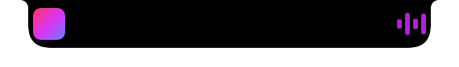

<p align="center"></p>

# Nunsseop

**Nunsseop** (눈썹, Korean for *eyebrow*) turns the MacBook notch into a small, useful space: what's playing, a file shelf, your calendar and system HUDs, all hanging from the top of the screen.

**English** · [한국어](README.ko.md) · [Website](https://namekun.github.io/Nunsseop/)

<p align="center">
  
</p>

## Features

- **Now playing.** Title, artist, artwork and playback controls for any app that reports to macOS Now Playing: Music, Spotify, YouTube Music, and browsers such as Safari, Chrome, Arc, Dia and Aside. Drag the progress bar to seek. The collapsed notch grows a small artwork and visualizer tinted with the artwork's colour.
- **Synced lyrics.** The current line from [LRCLIB](https://lrclib.net) under the title, or kept under the notch while music plays.
- **Sneak peek.** When the track or play state changes, the title appears under the notch for a few seconds (or always, if you prefer).
- **File shelf.** Drag files onto the notch to keep them and drag them back out when you need them. Drop files on the AirDrop tile to send them, or share them from the context menu. The shelf survives restarts.
- **Calendar and reminders.** A week strip, the selected day's events and the reminders due by then, which you can tick off from the notch.
- **Timer.** Countdown, Pomodoro and stopwatch, with the time left shown on the collapsed notch.
- **Clipboard history.** Recent copied text, searchable, one click to copy again. Kept in memory only, and items password managers mark as concealed are skipped.
- **Notes.** A scratchpad that is always one hover away.
- **Tools.** Switch the audio output, mute the microphone, keep the Mac awake and eject external drives.
- **System.** CPU, memory, disk and network at a glance.
- **Apps.** Launch anything in your Dock from the notch.
- **Weather.** Current conditions for your city in the header, from [Open-Meteo](https://open-meteo.com).
- **Downloads.** A heads-up when a download starts and finishes, optionally added to the shelf.
- **Mirror.** A quick look at yourself through the camera of your choice.
- **System HUDs.** Volume, brightness (built-in and DDC-capable external displays), keyboard backlight, power connected or disconnected, low battery and full charge, Caps Lock, and headphone battery (left, right and case) appear in the notch. New screenshots drop onto the shelf automatically.
- **Claude Code notifications.** Claude Code (or any local script) can show a message in the notch when it needs you; see below. Nunsseop can take over the volume and brightness keys so the system HUD no longer appears.
- **Gestures.** Swipe down on the notch to open it, up to close it, and left or right on the Home tab to skip tracks.
- **Settings.** Which display to use, size, hover delay, sneak peek, launch at login, update checks and every HUD can be adjusted.
- **Seven languages.** English, Korean, Japanese, Simplified Chinese, Spanish, German and French, following your macOS language.

Screens without a notch get a pill at the top centre instead.

<p align="center">
  
</p>
<p align="center">
  
  
</p>

## Requirements

- macOS 14 Sonoma or later (tested on macOS 26)
- Xcode command line tools with Swift 5.10 or later to build

## Install

With [Homebrew](https://brew.sh):

```sh
brew install --cask namekun/tap/nunsseop
```

Or download the latest `Nunsseop-<version>.dmg` from [Releases](https://github.com/namekun/Nunsseop/releases), open it and drag Nunsseop to Applications. The app is not notarized, so remove the quarantine flag once before the first launch (Homebrew does this for you):

```sh
xattr -dr com.apple.quarantine /Applications/Nunsseop.app
```

The app has no Dock icon. Hover over the notch to open it; right-click it for Settings and Quit.

## Build from source

```sh
git clone https://github.com/namekun/Nunsseop.git
cd Nunsseop
./scripts/bundle.sh release      # build/Nunsseop.app
./scripts/make-dmg.sh            # build/Nunsseop-<version>.dmg
```

`scripts/bundle.sh` builds the Swift package and wraps it in an app bundle with an ad-hoc signature.

## Claude Code notifications

Nunsseop listens on `127.0.0.1:47750` for notifications from tools on your Mac. Requests must carry the secret token stored in `~/Library/Application Support/Nunsseop/notify-token`.

To get a notch notification whenever Claude Code is waiting for you, open Nunsseop's Settings, press **Copy Claude Code hook command**, and add it to `~/.claude/settings.json`:

```json
{
  "hooks": {
    "Notification": [
      { "hooks": [{ "type": "command", "command": "<paste the copied command here>" }] }
    ]
  }
}
```

Any script can do the same:

```sh
curl -X POST http://127.0.0.1:47750/notify \
  -H "Authorization: Bearer $(cat ~/Library/Application\ Support/Nunsseop/notify-token)" \
  -d '{"title": "Build", "message": "Finished in 42 s"}'
```

## Permissions

| Feature | Permission | When it is asked |
| --- | --- | --- |
| Calendar | Calendars | When you press *Allow Access* on the Home tab |
| Reminders | Reminders | When you press *Allow Reminders* on the Home tab |
| Mirror | Camera | When you press *Allow Camera* on the Mirror tab |
| Taking over volume, brightness and keyboard backlight keys | Accessibility | When you turn the option on in Settings |
| Fallback now playing for Music/Spotify/browsers | Automation | Only if the MediaRemote helper is unavailable |
| Launch at login | Login Items | When you turn it on in Settings |

Because builds are ad-hoc signed, macOS may forget the Accessibility permission after you rebuild.

## How now playing works

Since macOS 15.4, the private MediaRemote framework only answers processes signed by Apple. Nunsseop ships a small helper library (`Sources/NowPlayingHelper`) that runs inside the system's `/usr/bin/perl`, reads the Now Playing state and sends play/pause/next/previous commands, and streams JSON lines back to the app.

This relies on private API and on how macOS treats Apple-signed binaries, so a future macOS update may break it. When the helper is unavailable, Nunsseop falls back to AppleScript for Music and Spotify, and to reading media tabs in browsers. That fallback needs *Allow JavaScript from Apple Events* turned on in each browser (Dia has no menu item for it and must be started with `--enable-applescript-javascript`).

## Privacy

Nunsseop does not collect or send any personal data. Its network use is limited to:

- checking `api.github.com` for a newer release once a day (can be turned off in Settings);
- accepting notifications from tools on your own Mac on `127.0.0.1:47750` (can be turned off in Settings);
- looking up synced lyrics for the playing track on `lrclib.net` (can be turned off in Settings);
- fetching weather from `open-meteo.com` for the city you enter (off until you enter one);
- downloading artwork over HTTPS from the image servers of known music and video services, only when the MediaRemote helper is unavailable.

The camera preview is shown only while the Mirror tab is open and is never recorded. Clipboard history stays in memory and is cleared when Nunsseop quits.

## License

[MIT](LICENSE)

